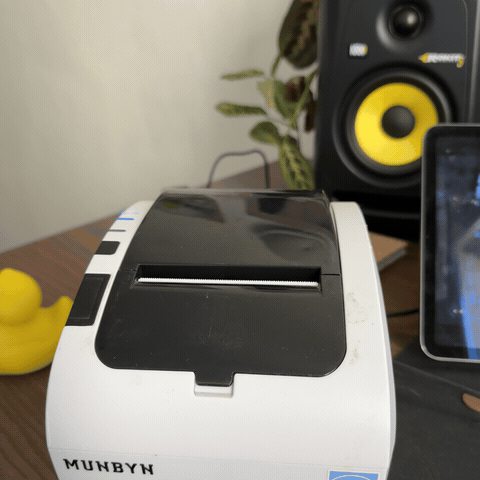

# FUNPRINT 🖨️




A tiny local CLI photo booth for **80mm / 58mm ESC/POS thermal receipt printers**.
Drag a picture into your terminal, see a preview of exactly what will print, and hit **P**.

Works on **macOS, Linux, and Windows**, with any thermal printer installed as a system
print queue (MUNBYN, Epson TM clones, Rongta, etc.).

## How it works

- Renders your image to **1-bit ESC/POS raster** (`GS v 0`): center-crop (or full image),
  resize to the printable width, and **Floyd–Steinberg dithering** (toggle to hard threshold).
- Sends raw bytes straight to the OS print queue — no QZ Tray, no server, no driver tricks:
  - **macOS / Linux:** CUPS `lp -o raw`
  - **Windows:** `winspool` RAW via a bundled PowerShell helper
- Previews in the terminal with truecolor half-block ANSI (works in any terminal).
- Reports honest status: **queued → printed**, or warns if the printer is offline.

## Setup

Requires [Node.js](https://nodejs.org) 18+ (and `git`). Then:

```sh
git clone https://github.com/KevinGallaccio/funprint.git
cd funprint
npm install
npm link        # puts `funprint` on your PATH (all platforms)
```

Now run `funprint` from anywhere.

<details>
<summary>Prefer not to <code>npm link</code>?</summary>

- **Any OS:** `npm start` (or `node src/cli.mjs`) from the project folder.
- **macOS/Linux alias:** `alias funprint='node /full/path/to/funprint/src/cli.mjs'` in your shell rc.
</details>

## Controls

| Key | Action |
| --- | --- |
| drag + Enter | load an image (png/jpg/webp/gif/tiff/bmp/avif/heic…) |
| **P** / Enter | print it |
| **S** | paper format: 58mm ↔ 80mm (↔ custom `FUNPRINT_WIDTH`) |
| **F** | square crop ↔ full image (whole picture, no crop) |
| **W** | blank write-space below: off → 40mm → 80mm (polaroid style) |
| **←/→** or **↑/↓** | reframe — slide the square crop along a non-square image |
| **D** | dither ↔ hard threshold |
| **R** | rotate 90° |
| **N** / **Q** | new image / quit |

The header shows the resolved printer and a live **●** dot: green = connected, red = offline,
dim = unknown (some platforms can't probe USB cheaply). On print, status goes **queued → printed**;
if the printer is unplugged you're told the job is queued and will print once reconnected.

## Testing without paper

```sh
funprint --dry-run     # writes the ESC/POS job to a file instead of printing
```

## Configuration

- `FUNPRINT_PRINTER` — print queue name. Unset = your OS default printer.
- `FUNPRINT_WIDTH` — custom printable dot-width (default `576` = 80mm). Becomes a selectable
  paper option. Rounded down to a multiple of 8.

## Platform notes

- **macOS** — fully tested. Connection dot reads the USB device via `ioreg`.
- **Linux** — uses the same CUPS path; the connection dot reports *offline* from CUPS but
  shows *unknown* otherwise (no cheap USB probe without root).
- **Windows** — raw printing goes through `scripts/raw-print.ps1` (winspool). Tested less than
  macOS — [issues/PRs welcome](https://github.com/KevinGallaccio/funprint/issues).

## License

MIT © Kevin Gallaccio
